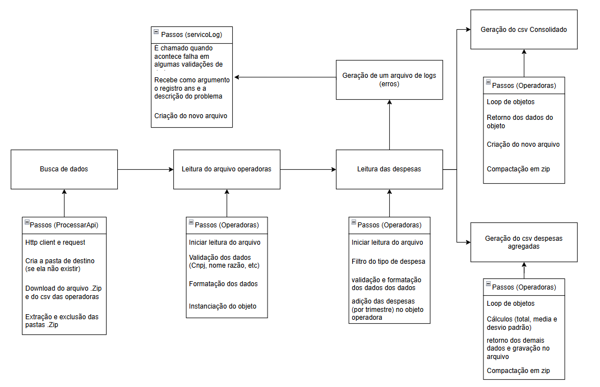

Orientações Gerais: 

1º e 2º exercícios: 

- Para executar o programa é preciso ir até o packpage application e executar o arquivo Program;
- O programa faz três coisas: Faz o download dos arquivos .zip da api, extrai eles, processa e limpa os dados e gera novos arquivos csv;
- Os arquivos vindos da Api são baixados e extraidos em uma pasta que é criada automaticamente na pasta raiz do projeto, "dados_brutos";
- Os arquivos csv gerados pelo sistema sao criados e compactados direto na pasta raiz do projeto;
- Detalhes dos trade-offs e comentários meus estarão logo abaixo;

1.2. Processamento de Arquivos:

- Eu decidi processar os arquivos incrementalmente principalmente por limitações de Hardware e volume de arquivos, inicialmente eu queria processar os dados na memória, mas ao fazer testes empiricos percebi que ao armazenar s dados do primeiro trimestre no computador o uso da memória saia de 62% para mais de 80%, e isso para um único arquivo, ou seja, muito ineficiente. Outro ponto que me convenceu do contrario foi o fato de gastar espaço na memória para dados "lixo", isto é, dados que eu não iria precisar. Outro fatos que levei em consideração foi a possibilidade de interrupçã, se por qualquer motivo a leitura do arquivo fosse interrompida eu teria armazenado, por exemplo, 90% do arquivo, enquanto que se eu tivesse processando os dados incrementamente eu ja teria processado 90% do arquivo, ou seja, em questão de tempo e risco de interrupção foi prefirivel o processamento incremental. Então por conta de liitações de hardware e de volume de dados eu escolhi o processamento incremetal.

1.3. Consolidação e Análise de Inconsistências:

- Para explicar como consolidei os dados e tratei das inconsistencias eu preciso primeiro explicar como os dados foram processados e armazenados. No exercio pedia para usar o CNPJ como chave primaria, para fazer o join entre as despesas e as operadoas, contudo isso não foi possível, pois o CNPJ não existe no arquivo de despesas, então optei por usar o registro ans, que é unico para cada empresa. Para garantir a integridade dos dados a primeira cisa que fiz foi ler o arquivo das operadoras extraindo todos os dados que seriam neessarios para o restante do programa, huve também a validação imediata dos dados, isto é, validação do cnpj, verificação do nome razão, formatação do nome razão, etc. Após os dados da operadora estarem limpos foi instanciado um objeto da classe operadora, aonde aconteceria a maior parte do programa. As operadoras foram armazenadas em um map, para facilitar o encontro das despesas corretas.

- A partir dai o proximo passo foi ler as despesas, usando o registro ans como chave primaria a despesa consegue ser pareada com a empresa, depois disso tem um filtro para encontrar a despesa com eventos / sinistros, a partir disso é feito a validação dos dados, despesas negativas foram ignoradas, ao pesquisar descobri que elas provavelmente são glosas, ou seja, e um dinheiro que foi recebido, não uma despesa, o motivo de isso ter sido ignorado é por conta do total de despesas. O ano foi extraido da data

